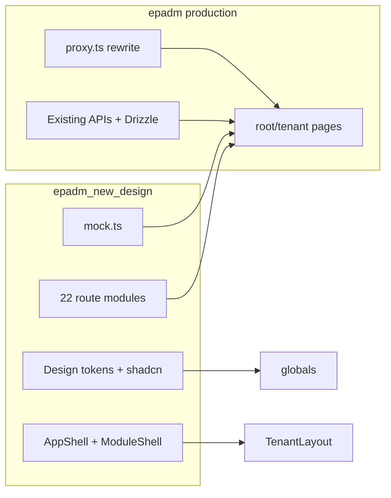
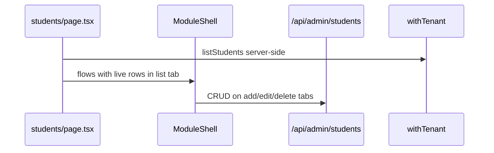

# EPADM Design Parity Migration Plan

## Current state vs target

| Area | Current [`epadm`](src/app) | Reference [`epadm_new_design`](epadm_new_design) |
|------|---------------------------|--------------------------------------------------|
| Design system | Custom tokens in [`globals.css`](src/styles/globals.css), bespoke UI primitives | shadcn/ui “new-york” + OKLCH tokens in [`styles.css`](epadm_new_design/src/styles.css) |
| Tenant shell | Inline nav in [`tenant-client-layout.tsx`](src/app/root/[tenant]/tenant-client-layout.tsx) | [`AppShell`](epadm_new_design/src/components/app-shell.tsx) + [`AppSidebar`](epadm_new_design/src/components/app-sidebar.tsx) + [`Topbar`](epadm_new_design/src/components/topbar.tsx) |
| Module pages | Generic [`ModuleWorkspace`](src/components/workspace/module-workspace.tsx) catch-all | Per-module route files with [`ModuleShell`](epadm_new_design/src/components/module-shell.tsx) / custom layouts (dashboard, attendance, timetable) |
| Live backends | Students, staff, academics, users, finance, partial attendance/exams | All mock data in [`mock.ts`](epadm_new_design/src/data/mock.ts) |
| Ops console | [`/admin`](src/app/admin) on ops host, dark sidebar | [`/cms`](epadm_new_design/src/routes/cms.tsx) red platform shell |
| Marketing | Framer Motion sections in [`(marketing)/page.tsx`](src/app/(marketing)/page.tsx) | Compact landing in [`routes/index.tsx`](epadm_new_design/src/routes/index.tsx) |



---

## Architectural decisions

### 1. Port reference components; do not run two apps
Copy/adapt from `epadm_new_design/src/components/` and `epadm_new_design/src/lib/module-registry.tsx` into `src/components/workspace/` and `src/lib/navigation/`. Keep Next.js App Router pages under `src/app/root/[tenant]/` — **do not** adopt the TanStack catch-all dispatcher.

### 2. Route alignment (with one proxy fix)

| Design URL | Production mapping | Notes |
|------------|-------------------|-------|
| `/fees` | New `fees/page.tsx`; redirect `/finance` → `/fees` | Preserve finance server actions/APIs |
| `/admin` (tenant RBAC) | New `admin/page.tsx` on tenant plane | **Requires proxy change** in [`proxy.ts`](src/proxy.ts): stop redirecting `/admin` on school host to ops; only ops host serves platform console |
| `/cms` (platform) | Restyle [`src/app/admin`](src/app/admin) to match design CMS | Keep ops hostname gating; add `/cms` alias on ops host |
| `/users` | 301 → `/admin` on tenant host | After proxy fix |
| Teacher/student | Redirect to `/dashboard` with notice | Per your choice to deprioritize |

### 3. Data strategy (per your answer)
- **Phase A (UI):** Every tab renders with design-accurate layout; use live data where APIs exist, otherwise seed from ported `mock.ts` structures.
- **Phase B (backend):** Replace mocks tab-by-tab following the roadmap below.
- **CRUD buttons:** Add standard View/Edit/Delete only on data tables; no new workflows beyond reference + CRUD.

### 4. Preserve unchanged
- [`proxy.ts`](src/proxy.ts) tenancy rewrite (`/root/[tenant]/`)
- Auth (`auth_token`, `PLATFORM_COOKIE`), CSRF, RLS/`withTenant`
- Existing API routes under `src/app/api/`
- Drizzle schema/migrations pattern

---

## Phase 1 — Design foundation (blocking)

**Goal:** One visual language across tenant + marketing surfaces.

1. **Dependencies** — Add to root [`package.json`](package.json): Radix primitives, `class-variance-authority`, `cmdk`, `sonner`, `tw-animate-css`, `react-hook-form`, `@hookform/resolvers`, `vaul`, `date-fns` (mirror [`epadm_new_design/package.json`](epadm_new_design/package.json)).

2. **Tokens** — Merge [`epadm_new_design/src/styles.css`](epadm_new_design/src/styles.css) into [`src/styles/globals.css`](src/styles/globals.css):
   - OKLCH semantic tokens (`--primary`, `--surface`, `--success`, sidebar tokens)
   - 13px base, Inter + JetBrains Mono
   - Keep marketing-specific tokens only where still needed during landing migration

3. **shadcn UI** — Copy `epadm_new_design/src/components/ui/*` → `src/components/ui/` (46 primitives). Bridge existing custom [`button.tsx`](src/components/ui/button.tsx) usages: map `primary|danger` call sites to shadcn `default|destructive` during migration.

4. **Utilities** — Port [`cn()`](epadm_new_design/src/lib/utils.ts), [`use-mobile`](epadm_new_design/src/hooks/use-mobile.tsx), add `Toaster` from sonner in root layout.

---

## Phase 2 — Tenant workspace shell

Replace [`TenantClientLayout`](src/app/root/[tenant]/tenant-client-layout.tsx) with ported:

- [`AppShell`](epadm_new_design/src/components/app-shell.tsx) + [`PageHeader`](epadm_new_design/src/components/app-shell.tsx)
- [`AppSidebar`](epadm_new_design/src/components/app-sidebar.tsx) fed by ported [`NAV`](epadm_new_design/src/lib/module-registry.tsx)
- [`Topbar`](epadm_new_design/src/components/topbar.tsx) wired to real `ctx.tenantName`, academic year, sign-out
- [`CommandPalette`](epadm_new_design/src/components/command-palette.tsx) (Cmd/Ctrl+K)
- [`CopilotDrawer`](epadm_new_design/src/components/copilot-drawer.tsx) (mock briefing initially)
- [`ExportMenu`](epadm_new_design/src/components/export-menu.tsx)

**RBAC:** Filter `NAV` groups by role (admin, accountant, etc.) — preserve current rules from tenant layout. **Module gating:** Optionally hide nav items not in `ctx.activeModules` (backend already supports this).

**Responsive:** shadcn `Sidebar` sheet overlay below 768px; collapsible icon rail at 220px/3rem.

---

## Phase 3 — Shared module framework

Port and adapt to Next.js (`usePathname`, `useSearchParams`, `router.replace`):

| Component | Source | Purpose |
|-----------|--------|---------|
| `ModuleShell` + `FlowView` | [`module-shell.tsx`](epadm_new_design/src/components/module-shell.tsx) | Horizontal grouped tabs via `?tab=` |
| `InnerRail` | [`inner-rail.tsx`](epadm_new_design/src/components/inner-rail.tsx) | Attendance secondary nav |
| `PageToolbar` + `Pagination` | [`page-toolbar.tsx`](epadm_new_design/src/components/page-toolbar.tsx) | Filters/search/export row |

Create `src/lib/modules/` with flow metadata extracted from each design route file (rail groups, flow definitions, columns, empty states).

---

## Phase 4 — Page-by-page UI port (22 routes)

Each page becomes `src/app/root/[tenant]/<module>/page.tsx` (+ client subcomponents). Delete reliance on [`[...module]/page.tsx`](src/app/root/[tenant]/[...module]/page.tsx) once all modules have dedicated pages.

### Priority order

| # | Route | Layout pattern | Backend today | Port source |
|---|-------|----------------|---------------|-------------|
| 1 | `/` marketing | Standalone | Live auth forms | [`routes/index.tsx`](epadm_new_design/src/routes/index.tsx) |
| 2 | `/dashboard` | AppShell custom bento | Partial live KPIs | [`routes/dashboard.tsx`](epadm_new_design/src/routes/dashboard.tsx) |
| 3 | `/students` | ModuleShell | **Live CRUD** | [`routes/students.tsx`](epadm_new_design/src/routes/students.tsx) + refactor [`student-registry.tsx`](src/app/root/[tenant]/students/student-registry.tsx) into `list`/`add` tabs |
| 4 | `/staff` | ModuleShell | **Live CRUD** | [`routes/staff.tsx`](epadm_new_design/src/routes/staff.tsx) |
| 5 | `/academics` | ModuleShell | **Live** classes/sections | [`routes/academics.tsx`](epadm_new_design/src/routes/academics.tsx) |
| 6 | `/fees` | ModuleShell | **Live** invoices/structures | [`routes/fees.tsx`](epadm_new_design/src/routes/fees.tsx) + migrate logic from [`finance/page.tsx`](src/app/root/[tenant]/finance/page.tsx) |
| 7 | `/admin` | ModuleShell | **Live** tenant users | [`routes/admin.tsx`](epadm_new_design/src/routes/admin.tsx) + [`users`](src/app/root/[tenant]/users/) logic |
| 8 | `/attendance` | AppShell + InnerRail | Partial (`attendance` table) | [`routes/attendance.tsx`](epadm_new_design/src/routes/attendance.tsx) (~660 lines, custom views) |
| 9 | `/exams` | ModuleShell | Partial (`exams` + AI gen) | [`routes/exams.tsx`](epadm_new_design/src/routes/exams.tsx) |
| 10 | `/timetable` | AppShell custom grid | None | [`routes/timetable.tsx`](epadm_new_design/src/routes/timetable.tsx) |
| 11 | `/admissions` | AppShell kanban | None | [`routes/admissions.tsx`](epadm_new_design/src/routes/admissions.tsx) |
| 12 | `/payroll` | ModuleShell | Partial (`staffPayroll`) | [`routes/payroll.tsx`](epadm_new_design/src/routes/payroll.tsx) |
| 13–21 | vehicles, communications, library, labs, ai-studio, intelligence, mobile, settings | ModuleShell | None / partial AI | respective `routes/*.tsx` |
| 22 | `/cms` (ops) | Standalone red shell | **Live** tenants/metrics | [`routes/cms.tsx`](epadm_new_design/src/routes/cms.tsx) |

### Wiring pattern for live modules (example: Students)



- **List tab:** Real data from existing lib helpers
- **Other tabs:** Design layout + mock data until backend phase
- **CRUD:** Hook primary actions to existing endpoints; add Delete where missing

### Dashboard specifics
Replace simplified [`dashboard/page.tsx`](src/app/root/[tenant]/dashboard/page.tsx) with full bento from reference: 6-col KPI strip, copilot briefing, fee/attendance charts (Recharts), heatmap, birthdays, intelligence highlights. Wire KPIs to live counts; charts use mock series until analytics APIs exist.

### Marketing landing
Replace Framer Motion homepage with reference landing (hero, login card, module grid, AI section, pricing, security). Keep real `/login` POST flow and legal pages; restyle legal pages to match token system.

---

## Phase 5 — Proxy & routing updates

In [`proxy.ts`](src/proxy.ts):

1. **Tenant host:** Allow `/admin` through `handleTenantRequest` (tenant RBAC page).
2. **Tenant host:** Add `/fees` to tenant routes; redirect `/finance` → `/fees`.
3. **Ops host:** Serve platform console at `/cms` (alias `/admin` → `/cms` or restyle in place).
4. **Deprioritize portals:** In [`root/[tenant]/page.tsx`](src/app/root/[tenant]/page.tsx), redirect `teacher`/`student` to `/dashboard` (remove dedicated portal entry).

---

## Phase 6 — Backend implementation roadmap

Schema today ([`schema.ts`](src/lib/db/schema.ts)): 19 tables — students, staff, academics, attendance, assignments, fees, payroll, exams, vehicle telemetry. **No tables** for admissions, timetable, communications, library, labs, mobile config, leave, subjects/streams/houses as first-class entities.

### Backend waves (after UI parity)

**Wave 1 — Extend existing tables (low schema risk)**
- Attendance module: expand `attendance` usage for feed/monthly/report tabs; add `leave_applications`, `holidays`, `attendance_session_config`
- Exams: extend `exams` jsonb for marks entry, hall tickets, grade slabs
- Fees: map all fee tabs to `feeStructures`, `studentInvoices`, `financialTransactions`
- Academics: add `subjects`, `class_subjects`, `academic_calendar`, `grading_schemes`
- Admin/RBAC: expose `permissions`, `rolePermissions`, `auditLogs` via new admin tab APIs

**Wave 2 — New operational domains**
- `admissions_pipeline` (stages, applications, assessments)
- `timetable_slots`, `timetable_entries`, `rooms`
- `payroll_runs`, `salary_components`, `salary_structures` (normalize beyond `staffPayroll`)
- `vehicles`, `routes`, `route_subscriptions` (beyond webhook telemetry)
- `communications_campaigns`, `message_templates`, `delivery_logs`

**Wave 3 — Facilities & platform config**
- Library: `books`, `library_members`, `circulation`, `fines`
- Labs: `labs`, `lab_bookings`, `equipment`, `consumables`
- Mobile: `mobile_feature_flags`, `app_branding`, `push_campaigns`
- Settings: tenant profile json on `tenants`, integrations, copilot prefs

**Per-wave deliverables:** schema migration + RLS policies (follow `0004`/`0010` pattern) + `src/lib/admin/<domain>.ts` + `/api/admin/<domain>` routes + swap mock rows in corresponding UI tabs.

---

## Phase 7 — QA & acceptance

**Visual parity checklist per page:**
- Layout shell, typography (13px), spacing (`p-6`, `h-14` topbar, `h-8` controls)
- Tab groups (OPERATE | REPORTS | CONFIGURE) and `?tab=` behavior
- Status badge colors (success/warning/danger)
- Responsive: sidebar sheet, horizontal tab scroll, table overflow
- Keyboard: Cmd/Ctrl+K, Cmd/Ctrl+B sidebar toggle

**Commands to run after each phase:**
```bash
npm run typecheck
npm run lint
npm run test
npm run build
```

**Manual smoke:** login → dashboard → each sidebar module → tab navigation → CRUD on students/staff → fees collection → sign out.

---

## Risk mitigations

| Risk | Mitigation |
|------|------------|
| `/admin` path conflict (tenant vs ops) | Host-based routing in proxy; tenant RBAC only on school host, CMS only on ops host |
| shadcn vs custom Button API drift | Adapter layer or bulk codemod of `variant="primary"` → `default` |
| 200+ sub-flow tabs | Generate flow configs from design route files; don't hand-copy row data |
| Large diff size | Land phases as stacked PRs: foundation → shell → dashboard → modules by group |
| Mock data lingering | Track tab-level `dataSource: live|mock` in module registry; backend waves flip flags |

---

## Suggested delivery sequence (PR-sized chunks)

1. **Foundation PR:** tokens, shadcn, sonner, utils
2. **Shell PR:** AppShell replaces TenantClientLayout, NAV registry, proxy route fixes
3. **Dashboard + marketing PR**
4. **People PR:** students, staff, admissions, admin/RBAC
5. **Academics PR:** academics, attendance, timetable, exams
6. **Operations PR:** fees, payroll, vehicles, communications
7. **Facilities + AI PR:** library, labs, ai-studio, intelligence, mobile, settings
8. **Ops CMS PR:** platform console restyle
9. **Backend Wave 1–3 PRs:** per roadmap above

**Estimated scope:** ~15–20k lines ported/adapted from reference; largest files are `attendance.tsx`, `dashboard.tsx`, `fees.tsx`, `students.tsx`, `cms.tsx`.
