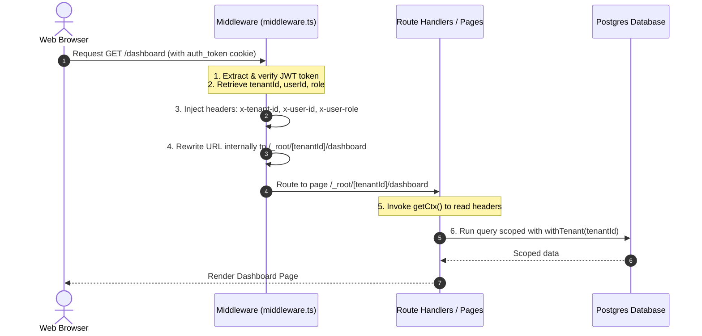
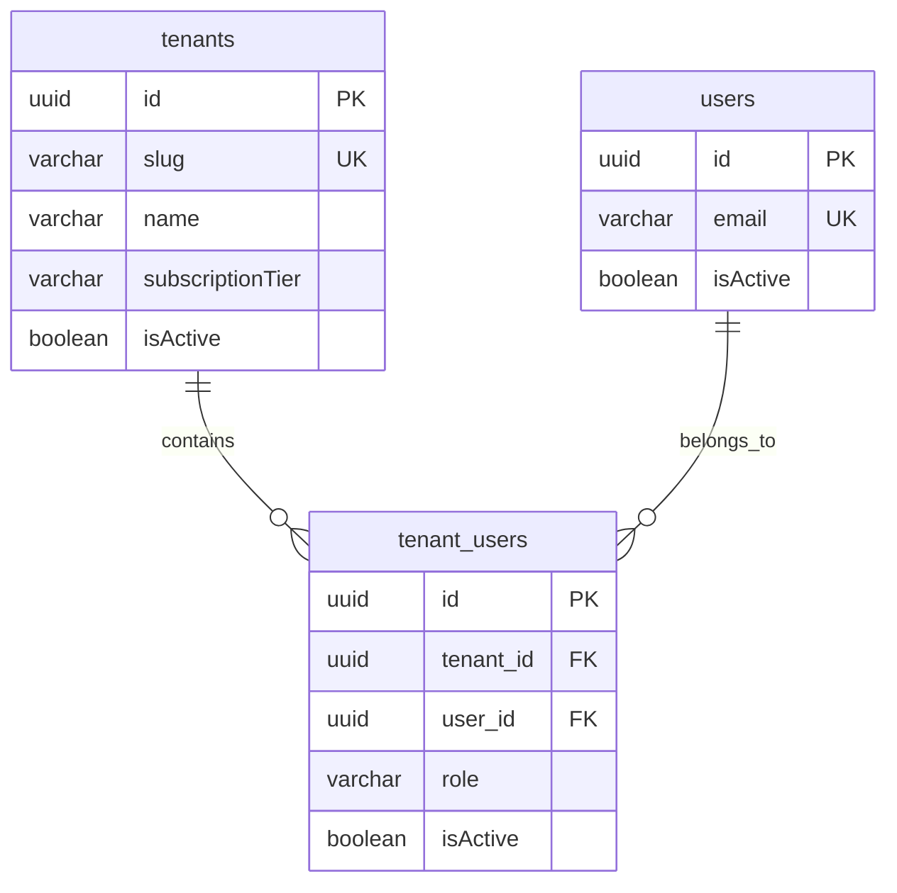

# Module 1: Multi-Tenancy & Request Context

## 1. Module Overview
The **Multi-Tenancy & Request Context** module forms the structural backbone of the EPADM platform. It enables multiple schools/educational institutions (tenants) to share a single codebase and database deployment while maintaining strict logical isolation of their data and UI experience. This follows the **shared-database, shared-schema** multi-tenancy model.

### Key Goals:
- **Tenant Identification**: Identify incoming requests based on a unique school identifier slug (e.g., `stxaviers`).
- **Dynamic Scoping**: Rewrite requests in the Next.js App Router to tenant-specific folders under the hood without changing the user-visible URL.
- **Request Context Propagation**: Propagate tenant ID, user ID, role, and subscription details to downstream server components, API handlers, and DB transactions.
- **Logical Query Scoping**: Scope database queries to the current tenant using transactions and Row-Level Security (RLS).

---

## 2. Current Architecture & Workflow
The multi-tenancy routing relies on a custom Next.js Middleware and path rewriting mechanism:



### Flow Step-by-Step:
1. **Interception**: Next.js Middleware intercepts incoming requests, skipping static assets and public routes.
2. **Session Verification**: The middleware extracts and decrypts the `auth_token` JWT cookie.
3. **Context Injection**: The middleware injects `x-tenant-id`, `x-user-id`, and `x-user-role` headers into the request.
4. **URL Rewriting**: For authenticated users, the middleware performs an internal Next.js rewrite:
   - FROM: `/dashboard`
   - TO: `/_root/${tenantId}/dashboard`
5. **Context Resolution**: Server components and Route Handlers resolve this context via `getCtx()`, which uses React's `cache` to parse the headers.
6. **Query Isolation**: Operations wrapped in `withTenant(tenantId, fn)` initiate a transaction and execute `SELECT set_config('app.current_tenant', tenantId, true)` before running database queries.

---

## 3. Feature-by-Feature Breakdown

### Tenant Slug Resolution
- Tenants are identified by a unique `slug` (a clean string, e.g., `stxaviers`).
- Public identity endpoints resolve this slug to the internal UUID `tenantId`.

### Middleware Scoping
- The middleware protects internal routes and automatically rewrites requests to the tenant path segment `/_root/[tenantId]`.
- Public routes like `/login`, `/register`, and `/onboarding` bypass this rewrite.

### Request Context Provider (`getCtx`)
- Resolves context details (`tenantId`, `userId`, `role`, `planTier`) using request headers.
- Caches context on a per-request basis using React's `cache` to avoid duplicate header parsing during a render cycle.

### Transaction-based RLS Wrapper (`withTenant`)
- Scopes a group of database queries inside a transaction to the current tenant ID by setting the Postgres session configuration parameter `app.current_tenant`.

---

## 4. Database Schema & Relationships

### `tenants` Table
Defines the individual tenant's configuration and subscription status.

| Column | Type | Constraints | Description |
|---|---|---|---|
| `id` | `uuid` | Primary Key, Default Random | Internal tenant UUID |
| `name` | `varchar(255)` | Not Null | Display name of the school |
| `slug` | `varchar(100)` | Not Null, Unique Index | Lowercase, unique URL path segment |
| `logoUrl` | `varchar(1024)`| Nullable | School crest or logo URL |
| `address` | `varchar(1024)`| Nullable | Physical address |
| `city` | `varchar(100)` | Nullable | City |
| `state` | `varchar(100)` | Nullable | State |
| `pincode` | `varchar(10)`  | Nullable | Postal/ZIP code |
| `phone` | `varchar(20)`  | Nullable | School contact phone |
| `email` | `varchar(255)` | Nullable | School contact email |
| `affiliationBoard` | `varchar(50)` | Nullable | Board affiliation (e.g., CBSE, ICSE) |
| `subscriptionTier` | `varchar(20)` | Not Null, Default `'basic'`| Tier: `'basic' \| 'pro' \| 'enterprise'` |
| `subscriptionExpiresAt` | `timestamp` | Nullable (With TZ) | Expiry timestamp |
| `settings` | `jsonb` | Not Null, Default `{}` | JSON-based tenant configurations |
| `isActive` | `boolean` | Not Null, Default `true` | Activation status |
| `createdAt` | `timestamp` | Not Null, Default `now()` | Timestamp of creation |



---

## 5. API Endpoints and Contracts

### GET `/api/identity/tenant`
Fetches basic metadata of a school tenant using its unique slug. Primarily used to verify school identifiers on the login/onboarding screen.

- **Request Query Parameters**:
  - `slug` (string, required): The school's unique url segment.

- **Success Response (200 OK)**:
  ```json
  {
    "id": "76495d46-4c74-4b53-b09b-640a233b8a36",
    "name": "St. Xavier School",
    "slug": "stxaviers",
    "subscriptionTier": "basic",
    "isActive": true
  }
  ```

- **Error Responses**:
  - **400 Bad Request**: Missing or invalid `slug` query parameter.
  - **404 Not Found**: No active tenant matching the slug was found.
  - **500 Internal Server Error**: Unexpected database or server error.

---

## 6. Business Logic & Validation Rules
- **Tenant Activation check**: Deactivated tenants (`isActive = false`) cannot be looked up via `/api/identity/tenant` and their members cannot log in.
- **Slug Constraints**: Slugs must be verified as unique before tenant registration, contain only alphanumeric characters and hyphens, and be stored in lowercase.

---

## 7. User Flows and UI Behavior
1. **Login Redirect**: Unauthenticated users visiting root `/` are redirected to `/login` by the middleware.
2. **Slug Verification**: When typing the "School Slug" in the login form, the interface verifies it against `/api/identity/tenant` (currently performed during login POST, can be extended for dynamic logo/branding loading).
3. **Internal Rewrite**: Upon successful authentication, the routing goes to `/dashboard`. The middleware translates this silently to `/_root/[tenantId]/dashboard`.
4. **Layout Context Display**: The sidebar (`src/app/_root/[tenant]/layout.tsx`) immediately displays the resolved tenant context (Tenant UUID, User ID, Role, and Plan Tier).

---

## 8. Third-Party Integrations
None currently configured.

---

## 9. Security Considerations
- **Header Injection Vulnerability**: The middleware writes context into headers (`x-tenant-id`, `x-user-id`, `x-user-role`). If deployed behind an external reverse proxy (e.g. Nginx, Cloudflare), it is critical that the proxy is configured to strip these headers from incoming client requests to prevent header spoofing.
- **Unenforced RLS Policies**: The `withTenant` wrapper sets `app.current_tenant` inside a transaction. However, Row Level Security is **not** enabled on the PostgreSQL tables. Without policies (`CREATE POLICY`), database-level multi-tenant isolation is not active, leaving isolation purely to application-level query filters.

---

## 10. Known Limitations
- **Slug Mutability**: Changing a tenant slug is not supported via self-service APIs and will break any bookmarks or active sessions utilizing the old slug.
- **Context Availability**: The `getCtx` helper depends on Next.js server-side `headers()` and cannot be invoked from scripts, CLI tools, cron tasks, or background queue worker threads.

---

## 11. Implementation Gaps
- **Lack of Database RLS Policies**: PostgreSQL tables do not have RLS enabled. Migrations must be generated to run:
  ```sql
  ALTER TABLE tenants ENABLE ROW LEVEL SECURITY;
  -- Add policies that check current_setting('app.current_tenant')
  ```
- **No Custom Domain Mapping**: Routing is strictly tied to path rewriting based on slugs. Mapping an external domain (e.g., `xavier.school.edu` -> `stxaviers` slug) in the middleware is not yet implemented.
- **No Tenant Creation UI**: The onboarding and registration route `/onboarding` is bypassed in the middleware, but no page or API handles onboarding.

---

## 12. Technical Debt & Refactoring Opportunities
- **Hardcoded Plan Tier**: `src/lib/context.ts` hardcodes `planTier = 'basic'` and contains a placeholder TODO to query the real plan tier from the database.
- **UUID exposure in Routing**: Rewriting `/dashboard` to `/_root/[tenantId]/dashboard` exposes the internal tenant UUID in the params instead of using the slug. This makes folder structure parameters hard to read during development.

---

## 13. Future Enhancements
- **SQL-Enforced Multi-Tenancy**: Generate migration scripts to automatically apply RLS policies to all tables containing a `tenant_id` column.
- **Domain Resolution Engine**: Add a domain mapping table to resolve `req.headers.get("host")` to the corresponding `tenantId` in the middleware.
- **Tenant Context Caching**: Store the active tenant configuration in Redis or a memory cache to avoid running a SQL query to verify the tenant for every login or metadata call.
