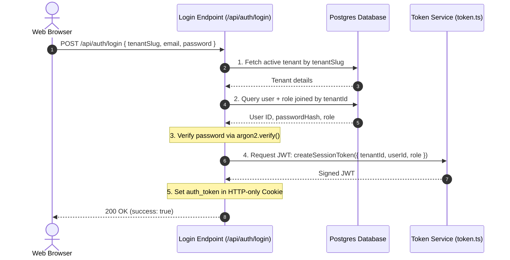

# Module 2: Authentication & Session Management

## 1. Module Overview
The **Authentication & Session Management** module is responsible for user identity verification, secure credential storage, tenant-specific role authorization, and request session maintenance. 

### Key Goals:
- **Secure Password Storage**: Hash passwords using standard, GPU-resistant hashing (Argon2).
- **Tenant-Scoped Authorization**: Ensure users are authenticated relative to a specific school tenant with predefined roles.
- **Stateless Session Control**: Issue secure JSON Web Tokens (JWT) for authentication state propagation.
- **Client Session Integration**: Store sessions inside secure, HTTP-only client cookies.

---

## 2. Current Architecture & Workflow
Authentication follows a tenant-scoped cookie-session pattern:



### Authentication Flow:
1. **Submit Credentials**: The user submits their email, password, and target school slug via the login form.
2. **Tenant Verification**: The system checks if the requested tenant slug exists and is active.
3. **User Search**: The system queries the `users` table joined with the `tenant_users` table to fetch the user matching the email, linked to the verified tenant, and retrieves their role.
4. **Password Verification**: The plaintext password is verified against the database `passwordHash` using Argon2.
5. **Token Generation**: On successful verification, a JWT payload containing `tenantId`, `userId`, and `role` is generated and signed with the system's `AUTH_SECRET`/`JWT_SECRET`.
6. **Cookie Setting**: The signed token is sent back in an HTTP-only, secure, SameSite=Lax cookie named `auth_token` with an expiration of 7 days.
7. **Session Clearance**: When logging out, the cookie value is overridden with an empty string and a `maxAge` of 0.

---

## 3. Feature-by-Feature Breakdown

### Password Encryption
- High-security hashing is enforced using `argon2` during user verification. Password hashes are stored under `password_hash` in the database.

### Tenant-Scoped Role Mapping
- A user can exist in multiple tenants with different roles. During authentication, the system dynamically binds the user to their specific role inside the requested tenant.

### JWT Token Operations
- **Signing**: Done via `SignJWT` from the `jose` library with the `HS256` signature algorithm.
- **Verification**: Done via `jwtVerify` during middleware execution to recover the session details.

### Cookie Configuration
- Cookies are configured with maximum security settings: `httpOnly: true` (prevents cross-site scripting access), `secure: true` in production (enforces HTTPS), and `sameSite: "lax"`.

---

## 4. Database Schema & Relationships

### `users` Table
Stores primary identity and account details.

| Column | Type | Constraints | Description |
|---|---|---|---|
| `id` | `uuid` | Primary Key, Default Random | Primary identifier |
| `email` | `varchar(255)` | Not Null, Unique Index | Unique login email |
| `phone` | `varchar(20)` | Nullable, Unique Index | Contact number |
| `passwordHash` | `varchar(255)`| Not Null | Argon2 hashed password |
| `name` | `varchar(255)` | Not Null | Display name of the user |
| `avatarUrl` | `varchar(1024)`| Nullable | Optional user avatar path |
| `isVerified` | `boolean` | Not Null, Default `false` | Email/phone verification state |
| `isActive` | `boolean` | Not Null, Default `true` | Account state (disabled users cannot log in) |
| `createdAt` | `timestamp` | Not Null, Default `now()` | Date registered |
| `updatedAt` | `timestamp` | Not Null, Default `now()` | Date of last profile update |

### `tenant_users` Table
Represents the mapping of users to specific tenants and their designated roles.

| Column | Type | Constraints | Description |
|---|---|---|---|
| `id` | `uuid` | Primary Key, Default Random | Mapping ID |
| `tenantId` | `uuid` | Not Null, FK -> `tenants.id` (onDelete: cascade) | Target tenant ID |
| `userId` | `uuid` | Not Null, FK -> `users.id` (onDelete: cascade) | Target user ID |
| `role` | `varchar(30)` | Not Null | Role string |
| `isActive` | `boolean` | Not Null, Default `true` | Membership status in this school |
| `joinedAt` | `timestamp` | Not Null, Default `now()` | Date joined school tenant |

*Constraints*: Unique composite index `tenant_users_tenant_user_role_unique` on `(tenantId, userId, role)`.

---

## 5. API Endpoints and Contracts

### POST `/api/auth/login`
Authenticates a user for a specific tenant and sets a session cookie.

- **Request Body Payload**:
  ```json
  {
    "tenantSlug": "stxaviers",
    "email": "admin@stxaviers.com",
    "password": "mypassword123"
  }
  ```
- **Payload Validation**: Zod schema requiring `email`, minimum password length of 6 characters, and a school slug.

- **Success Response (200 OK)**:
  ```json
  {
    "success": true
  }
  ```
  *(Header: `Set-Cookie: auth_token=<JWT_TOKEN>; HttpOnly; Path=/; Max-Age=604800`)*

- **Error Responses**:
  - **400 Bad Request**: Invalid inputs or non-existent school slug.
  - **401 Unauthorized**: Incorrect email or password, or deactivated user account.
  - **500 Internal Server Error**: Database connection or decryption library issues.

### POST `/api/auth/logout`
Clears the session cookie, effectively logging out the user.

- **Success Response (200 OK)**:
  ```json
  {
    "success": true
  }
  ```
  *(Header: `Set-Cookie: auth_token=; Max-Age=0`)*

---

## 6. Business Logic & Validation Rules
- **Account State Isolation**: If a user is globally deactivated (`users.isActive = false`), they cannot access *any* school tenant. If a user is only deactivated within a specific school (`tenant_users.isActive = false`), they are barred from logging into that tenant but might still log into others if mapped.
- **JWT Payload Integrity**: If the token contains invalid fields or the signature check fails, the middleware rejects the session.
- **Zod Schema Verification**: Inputs are strictly sanitised. For example, `tenantSlug` is converted to a trimmed lowercase string before querying.

---

## 7. User Flows and UI Behavior
1. **Interactive Form Input**: Form fields for school identifier, email, and password.
2. **Submit Handling**: Disables form inputs and changes the submit button to "Signing in..." to prevent double submissions.
3. **Error Reporting**: Invalid configurations display an inline red text alert reading `error` from the API.
4. **Successful Auth**: Triggers client-side redirect using Next.js `useRouter().push("/dashboard")`.

---

## 8. Third-Party Integrations
None currently configured.

---

## 9. Security Considerations
- **Argon2 Resource Protection**: Argon2 is configured with modern parameters to thwart brute force attempts.
- **Insecure Dev Mode Fallback**: If the server launches without `AUTH_SECRET` or `JWT_SECRET` in environment variables, a warning is printed and a default `dev-insecure-secret` is loaded. **This fallback must be disabled in production environments.**
- **Stateless Revocation**: JWTs are verified without a database lookup to maximize performance. As a result, tokens cannot be revoked administratively before their 7-day expiration unless a blocklist is introduced.

---

## 10. Known Limitations
- **Single Role Assumption**: If a user has multiple roles within the same tenant, the current database query retrieves the first matching row. There is no mechanism to choose a role at login or toggle roles while logged in.
- **Static Expiry**: Sessions are valid for exactly 7 days from generation. There is no sliding session expiration or refresh token mechanism.

---

## 11. Implementation Gaps
- **No Logout UI Trigger**: There is no sign-out button in the user dashboard. Users must clear cookies or call the endpoint manually to log out.
- **No User Registration Route**: The codebase has no `/api/auth/register` or `/register` page implementation. New users must be added directly via database commands.
- **No Password Reset Protocol**: Lacks email verification, OTP setup, or password reset API pathways.

---

## 12. Technical Debt & Refactoring Opportunities
- **Dev Secret Crash Enforcement**: The codebase prints a warning when the secret is missing. The system should throw a startup crash error if the environment is `production` and `AUTH_SECRET`/`JWT_SECRET` is missing.
- **Loose Types in Context**: In `src/lib/context.ts`, the `role` is typed as `UserRole | string` to allow flexibility, which bypasses compile-time type checking.

---

## 13. Future Enhancements
- **Multi-Role Swapper**: Implement an API and UI dropdown allowing users with multiple roles (e.g., a teacher who is also an admin) to switch profiles seamlessly.
- **Administrative Revocation**: Implement a Redis-backed token blacklist or database `session` registry.
- **Two-Factor Authentication (2FA)**: Introduce TOTP or email OTP verification for high-privilege roles (e.g., admin, accountant).
- **Audit Logs**: Store login timestamp, IP address, and browser metadata to build a login history dashboard.
